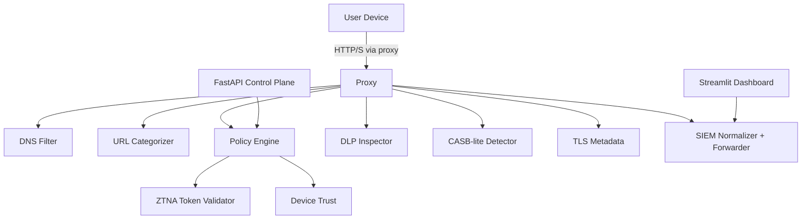

# Architecture Overview

This mini-cloud models a Secure Access Service Edge (SASE) Point of Presence with an explicit web proxy, Zero Trust enforcement, DNS filtering, CASB-lite, DLP-lite, and SIEM logging. The components run as cooperating Python services or scripts and share configuration from `config/`.

## Components

- **gateway/**: Enforcement plane used by the proxy. It evaluates DNS blocklists, URL categories, Zero Trust posture, CASB detections, DLP-lite signals, and TLS metadata before returning an allow/block decision.
- **auth/**: Token and device posture validators consumed by the policy engine.
- **api/**: FastAPI control plane for policy CRUD, token validation, health, and retrieving normalized logs.
- **casb/**: Cloud app detection and forbidden activity rules for shadow IT coverage.
- **siem/**: Log normalization and file-backed forwarding for dashboard and SIEM ingestion.
- **dashboard/**: Streamlit-based view of recent activity, blocked traffic, DLP and CASB hits, and Zero Trust posture outcomes.
- **config/**: All policies, blocklists, categories, and token maps.

## Data Flow

1. **Ingress**: A client routes HTTP/S traffic through the explicit proxy (port 8888 in Docker Compose).
2. **Categorisation & DNS**: Domains are checked against blocklists and categories are derived from regex/keyword patterns.
3. **Zero Trust Checks**: Tokens and device posture are validated before policy evaluation.
4. **Policy Decision**: The policy engine combines user-specific rules, blocked categories/domains, and allowlists.
5. **CASB & DLP-lite**: Uploads and payloads are inspected for cloud app usage and sensitive data patterns.
6. **TLS Metadata**: ClientHello metadata (server name, cipher, TLS version) is captured for observability.
7. **Decision & Logging**: The request is allowed or blocked, a structured log is normalized, and the forwarder persists the event for dashboard/SIEM consumption.

## Deployment Profiles

- **Local execution**: Run modules directly for rapid iteration and testing.
- **Docker Compose**: Launch proxy, control plane, and dashboard containers with shared volumes for configuration and logs.
- **CI/CD**: GitHub Actions executes linting (ruff, black, isort, mypy) and the pytest suite for every push and PR.

## Extensibility

- Add new categories by editing `config/categories.json` and extending `gateway/url_categorizer.py` patterns.
- Extend DLP-lite heuristics in `gateway/dlp_inspector.py` with additional regexes or keywords.
- Modify CASB detections in `casb/cloud_app_detector.py` and `casb/forbidden_activity_rules.py` to reflect SaaS policy.
- Swap the SIEM forwarder destination in `siem/log_forwarder.py` to push to a remote collector.
