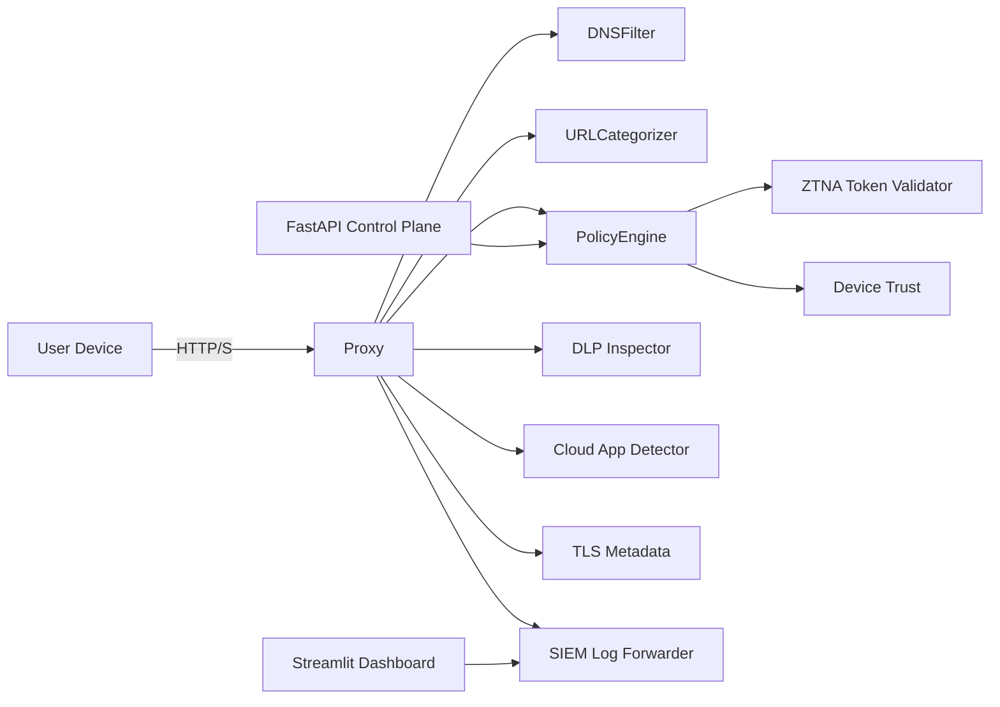

# SASE / Secure Web Gateway Mini-Cloud

A lightweight, containerised Secure Access Service Edge (SASE) and Secure Web Gateway (SWG) that demonstrates URL filtering, DNS inspection, TLS metadata inspection, DLP-lite scanning, CASB-lite detection, Zero Trust enforcement, and SIEM-grade logging. The project is intentionally self-contained so it can be explored locally or with Docker Compose.

## Documentation

- [Architecture](docs/ARCHITECTURE.md)
- [Control Plane API](docs/API.md)
- [Operations & Runbook](docs/OPERATIONS.md)

## Architecture



- **Gateway (proxy)**: Orchestrates DNS, category, TLS metadata, Zero Trust, CASB-lite, and DLP-lite checks before deciding allow/block.
- **Control plane (FastAPI)**: Policy CRUD, token validation, health, and log retrieval.
- **Dashboard (Streamlit)**: Visualises events, categories, and DLP/CASB insights from the SIEM log file.
- **Config**: Policies, blocklists, categories, and tokens live under `config/`.

## Project Layout

```
sase_gateway/
  gateway/               # Enforcement engines
  auth/                  # Zero Trust identity & device checks
  api/                   # FastAPI control plane
  dashboard/             # Streamlit visualisation
  casb/                  # Cloud app and activity detection
  siem/                  # Log normalisation and forwarding
  config/                # Policies, blocklists, categories
  tests/                 # Pytest suite
  docker-compose.yml
  requirements.txt
```

## Features
- **Explicit proxy simulation** with URL parsing, DNS enforcement, TLS SNI metadata capture, and per-request decisioning.
- **Zero Trust** checks for both user token validity and device posture, backed by configurable token store.
- **DNS filtering** using configurable blocklists for malware, social media, and adult content.
- **URL categorisation** driven by keywords/regexes in `config/categories.json`.
- **DLP-lite** scanning for AU PII (TFN, Medicare, phone patterns) plus sensitive keywords.
- **CASB-lite** detection of cloud storage uploads and shadow IT patterns.
- **Control plane API** (FastAPI) for status, token verification, user registration, and policy updates.
- **Streamlit dashboard** for real-time visibility into allowed/blocked traffic.
- **SIEM forwarder** that normalises and ships structured JSON logs.

## Quickstart (Local)

```bash
python -m venv .venv
source .venv/bin/activate
pip install -r requirements.txt
pytest
python gateway/proxy.py
```

### Route traffic through the proxy
Set your application's HTTP proxy to `http://localhost:8888`. The sample `SecureWebGateway` runs inline and writes logs to `streamlit_logs/gateway.log`.

### Control plane (FastAPI)
```bash
uvicorn api.control_plane:app --reload --port 8000
```
Test endpoints:
```bash
http GET :8000/status
http POST :8000/token/verify token==token-alice
http POST :8000/user/register username==carol token==token-carol
```

### Dashboard (Streamlit)
```bash
streamlit run dashboard/app.py --server.port 8501
```

### Docker Compose
```bash
docker-compose up
```
Services:
- `proxy` on port `8888`
- `control-plane` on port `8000`
- `dashboard` on port `8501`

## Configuration & Policies
- Update tokens and per-user rules in `config/policies.yaml` (`tokens` map plus `users` policies).
- Add new blocklists under `config/blocklists/` and categories in `config/categories.json`.
- CASB rules live in `casb/forbidden_activity_rules.py` and cloud app mappings in `casb/cloud_app_detector.py`.

## API Surface
- `POST /policy/update` — replace policy document with posted payload.
- `GET /logs` — fetch recent normalized log events.
- `POST /user/register` — register a user/token and seed baseline policy.
- `POST /token/verify` — validate a Zero Trust token.
- `GET /status` — health and configuration paths.

## Zero Trust & Policy Logic
- Tokens validated by `auth/ztna_token_validator.py` (loads from `config/policies.yaml` `tokens` block).
- Device posture from `auth/device_trust.py` enforces minimum health + score.
- Policy evaluation in `gateway/policy_engine.py` checks blocked categories/domains and allowlists.
- DNS blocklists and category-based restrictions combine to determine the final allow/block decision.

## Logging & SIEM
Normalized JSON logs are written to `streamlit_logs/gateway.log` and can be tailed or ingested by the dashboard. Each record includes user, domain, categories, CASB/DLP outcomes, and TLS metadata.

## Testing & Quality
- Run `pip install -r requirements-dev.txt` to install developer tooling.
- Run `ruff check .`, `black --check .`, `isort --check-only .`, `mypy .`, and `pytest` before committing.
- CI runs the same suite via GitHub Actions (`.github/workflows/ci.yml`).

## Security & Governance
- Licensed under MIT (`LICENSE`).
- Contribution guidance in `CONTRIBUTING.md`; community standards in `CODE_OF_CONDUCT.md`.
- Security reporting and hardening notes are in `SECURITY.md`.
